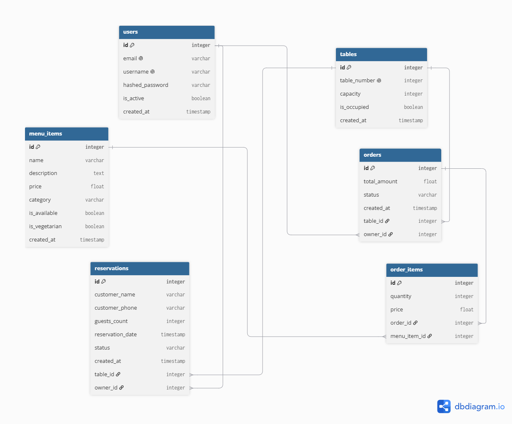
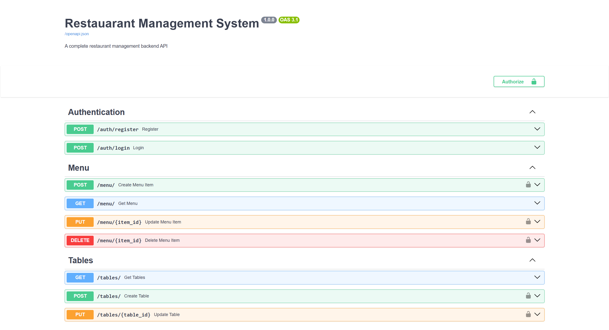

# 🍽️ Restaurant Management System

A complete restaurant management backend API built with FastAPI and PostgreSQL.

---

## 🚀 What This Project Does

- Register and login securely
- Manage menu items with categories
- Track table availability
- Take and manage orders with multiple items
- Calculate order totals automatically
- Handle table reservations
- Update table status on order completion

---

## 🧠 What I Learned Building This

- Menu management with filtering
- Order creation with multiple items
- Automatic total calculation
- Table status management
- Reservation system
- Complex order → table relationship

---

## 🛠️ Tech Stack

| Technology | Purpose |
|------------|---------|
| Python 3.14 | Programming language |
| FastAPI | Web framework |
| PostgreSQL | Database |
| SQLAlchemy | ORM |
| Alembic | Migrations |
| PyJWT | Authentication |
| bcrypt | Password hashing |
| Docker | Containerization |
| Uvicorn | Server |

---

## ⚙️ How To Run

### Without Docker:
```bash
git clone https://github.com/sivamani151dev-cell/restaurant-management.git
cd restaurant-management
python -m venv venv
venv\Scripts\activate
pip install -r requirements.txt
python -m alembic upgrade head
uvicorn app.main:app --reload
```

### With Docker:
```bash
docker-compose up --build
```

---

## 📡 API Endpoints

### Authentication
| Method | Endpoint | Description | Auth |
|--------|----------|-------------|------|
| POST | `/auth/register` | Register | ❌ |
| POST | `/auth/login` | Login | ❌ |

### Menu
| Method | Endpoint | Description | Auth |
|--------|----------|-------------|------|
| POST | `/menu/` | Add item | ✅ |
| GET | `/menu/` | Browse menu | ❌ |
| PUT | `/menu/{id}` | Update item | ✅ |
| DELETE | `/menu/{id}` | Delete item | ✅ |

### Tables
| Method | Endpoint | Description | Auth |
|--------|----------|-------------|------|
| POST | `/tables/` | Add table | ✅ |
| GET | `/tables/` | Get all tables | ❌ |
| PUT | `/tables/{id}` | Update table | ✅ |

### Orders
| Method | Endpoint | Description | Auth |
|--------|----------|-------------|------|
| POST | `/orders/` | Create order | ✅ |
| GET | `/orders/` | Get all orders | ✅ |
| GET | `/orders/{id}` | Get order | ✅ |
| PUT | `/orders/{id}` | Update status | ✅ |

### Reservations
| Method | Endpoint | Description | Auth |
|--------|----------|-------------|------|
| POST | `/reservations/` | Make reservation | ✅ |
| GET | `/reservations/` | Get all | ✅ |
| PUT | `/reservations/{id}` | Update status | ✅ |

---

## 📊 Database Schema



---

## 📸 Screenshots



---

## 🎯 Project Type
Client-Ready Project — built to demonstrate real-world restaurant management capabilities.